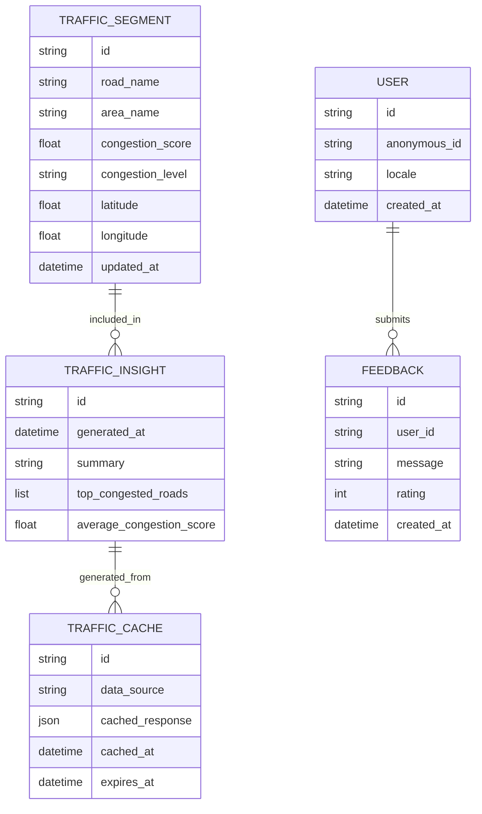
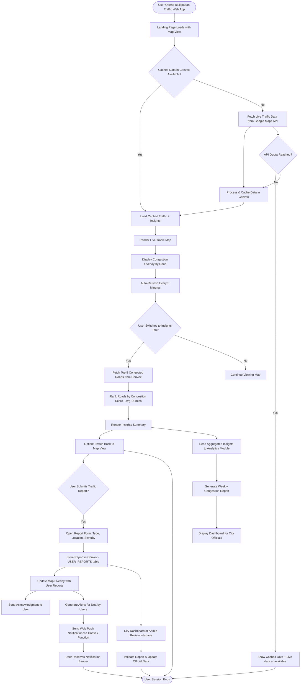

# Balikpapan Traffic Jam Web App (PRD)

**Version:** 1.2
**Date:** 2025-11-12
**Owner:** Gulfani Putra

## Table Of Contents

1. [Executive Summary](#1-executive-summary)
2. [Overview](#2-overview)
3. [Problem Statement](#3-problem-statement)
4. [Goals & Objectives](#4-goals--objectives)
5. [Target Users](#5-target-users)
6. [User Stories](#6-user-stories)
7. [Technical Overview](#7-technical-overview)
8. [Database Schema](#8-database-schema)
9. [Data Flow Diagram](#9-data-flow-diagram)
10. [Process/User Flow Chart](#10-processuser-flow-chart)
11. [Design & UX Guidelines](#11-design--ux-guidelines)
12. [Assumptions](#12-assumptions)
13. [Dependencies & Risks](#13-dependencies--risks)
14. [Cost Management & API Usage Precautions](#14-cost-management--api-usage-precautions)
15. [Roadmap](#15-roadmap)
16. [Known Gaps & Edge Case Handling](#16-known-gaps--edge-case-handling)
17. [Success Metrics](#17-success-metrics)

## 1. Executive Summary

The **Balikpapan Traffic Jam Web App** helps commuters visualize live traffic congestion and plan smarter routes using Google Maps data. It is designed for simplicity, accuracy, and low operational cost for city-scale deployment. The app focuses on reducing commuting stress through real-time insights and a soothing, Nordic-inspired interface.

## 2. Overview

The **Balikpapan Traffic Jam Web App** provides real-time visualization of traffic congestion across the city of Balikpapan, East Kalimantan, Indonesia. It helps commuters quickly identify congested areas and plan routes accordingly.

### MVP Features

1. **Live Traffic Visualization:** Display a map with live traffic congestion overlay for Balikpapan.
2. **Insights Tab:** Show the top 5 most congested roads/areas based on real-time traffic data.

### Future Features

- User-reported incidents (_e.g._ accidents & roadblocks)
- Real-time alerts and notifications
- Smart route suggestions and predictive congestion
- Weekly analytics dashboard
- Multi-language support (_i.e._ Indonesian & English)

## 3. Problem Statement

Balikpapan commuters face unpredictable congestion and lack localized, city-specific data. While navigation apps show regional traffic, they don’t provide clear Balikpapan-level insights. This app bridges that gap by giving residents a focused, intuitive view of city traffic hotspots.

## 4. Goals & Objectives

### Goals

- Provide an easy, calming way for users to assess current traffic conditions.
  **Success Metric:** ≥ 90% user satisfaction.
- Enable informed travel decisions with real-time clarity.
  **Success Metric:** Daily active users ≥ 500 after 3 months.
- Keep operational costs within Google’s free API tier.
  **Success Metric:** Monthly cost ≤ $10 post-launch.

### Non-Goals

- Not a navigation or route-planning app in MVP.
- Not focused on gamification, ads, or user accounts initially.

## 5. Target Users

- Daily commuters in Balikpapan
- Local delivery, logistics, and ride-hailing drivers
- City officials and planners analyzing traffic trends

## 6. User Stories

### 6.1 Live Traffic Visualization

**As a** commuter
**I want to** see a live traffic map of Balikpapan
**So that I can** avoid congested routes quickly.

**Acceptance Criteria**

- Default map view: Balikpapan city limits
- Google Maps traffic layer visible by default
- Map auto-refresh every 5 minutes
- Smooth panning/zooming without data loss
- Display 'last updated' timestamp

### 6.2 Insights Tab

**As a** user
**I want to** see a ranked list of top 5 congested roads
**So that I can** understand traffic hotspots at a glance.

**Acceptance Criteria**

- Insights auto-refresh every 15 minutes
- Roads sorted by congestion level calculated from average `congestion_score` in last 15 minutes
- If data unavailable, show message:
  _"Traffic data temporarily unavailable."_

### 6.3 Responsive Design

**As a** mobile user
**I want to** check traffic on my phone easily
**So that I can** plan routes while on the go.

**Acceptance Criteria**

- Layout adjusts seamlessly to small screens
- Touch interactions and map gestures supported
- Page load time < 3 seconds on 4G

## 7. Technical Overview

- **Frontend:** React, TypeScript, Vite, & pnpm
- **Backend:** Convex
- **Map Provider:** Google Maps JavaScript API
- **Hosting:** Vercel (frontend) & Convex (backend)

**Data Handling**

- The app retrieves live traffic data from Google Maps and caches summaries in Convex.
- Cached data minimizes API calls and supports fallback display during quota limits.

## 8. Database Schema



## 9. Data Flow Diagram

```mermaid
flowchart TD
    subgraph UserBrowser [User Browser]
        A1[User opens Balikpapan Traffic Web App]
        A2[Map & Insights UI render in React]
    end

    subgraph Frontend [React + TypeScript (Vite)]
        F1[Request traffic data]
        F2[Render Google Map with Traffic Layer]
        F3[Fetch insights summary from backend]
    end

    subgraph Backend [Convex Backend]
        B1[Check Convex cache for recent traffic data]
        B2{Cache valid?}
        B3[Return cached traffic data]
        B4[Fetch fresh data from Google Maps API]
        B5[Process & store summary in storage]
    end

    subgraph External [External Data Source]
        E1[Google Maps JavaScript API]
    end

    subgraph Storage [Convex Database]
        D1[(TRAFFIC_CACHE)]
        D2[(TRAFFIC_SEGMENT)]
        D3[(TRAFFIC_INSIGHT)]
    end

    A1 --> F1 --> B1
    B1 --> B2
    B2 -- Yes --> B3 --> F2
    B2 -- No --> B4 --> E1
    E1 --> B5 --> D1 & D2 & D3
    B5 --> F3 --> A2

    F2 -->|Displays real-time map| A2
    F3 -->|Displays top 5 congested roads| A2
```

## 10. Process/User Flow Chart



## 11. Design & UX Guidelines

### Visual Style

- **Nordic-inspired aesthetic:** calm, minimalist, and clean
- **Colors:** cool blues, foggy greys, and muted neutrals
- **Typography:** clear sans-serif fonts with medium weight
- **White space:** ample breathing room for readability

### UX Principles

- Smooth, soft animations with no jarring transitions
- Logical visual hierarchy with simple icons and clear color codes
- Fully responsive and touch-friendly
- Local charm: subtle Balikpapan motifs (_e.g._ landmarks & icons)

### Design Goal

Deliver a soothing, visually calm interface that reduces commuter stress.

## 12. Assumptions

- Google Maps traffic layer provides reliable coverage for Balikpapan.
- Convex remains within free-tier limits during MVP.
- Users access primarily via mobile browsers.
- Live traffic updates are refreshed every 5 minutes.
- MVP limited to Balikpapan boundaries only.

## 13. Dependencies & Risks

| Risk                  | Description                              | Mitigation                                          |
| --------------------- | ---------------------------------------- | --------------------------------------------------- |
| Google Maps API Cost  | High API usage can exceed free tier      | Cache responses, set quotas, monitor usage          |
| Data Accuracy         | Relies entirely on Google traffic data   | Cross-check periodically, disclaim limitations      |
| Network Issues        | Users may have unstable mobile internet  | Graceful fallbacks, retry logic                     |
| Browser Compatibility | Older browsers may have rendering issues | Optimize for modern browsers (Chrome, Safari, Edge) |

## 14. Cost Management & API Usage Precautions

### Free Tier Usage

- Google Maps provides $200/month free credit (~28,000 map loads).
- The traffic layer counts toward this usage.

### Preventive Measures

- Set **budget alerts** at 50%, 90%, and 100% usage.
- Enforce **daily API quotas**.
- Use **Convex cache** to reduce API calls.
- **Restrict API key** by domain and service type.
- Implement **lazy loading** for map components.
- Explore **OpenStreetMap + MapLibre** in the future.

### Cost Goals

- Stay within $200 free tier during MVP.
- Keep monthly cost under $10 afterward.

## 15. Roadmap

### Phase 1 (MVP)

- Live map with congestion overlay
- Insights tab
- Responsive UI
- Basic caching & cost controls

### Phase 2

- User reports & alerts
- Smart route suggestions
- Analytics dashboard
- Bilingual UI (_i.e._ Indonesia & English)
- Integration with city data

## 16. Known Gaps & Edge Case Handling

### 1. Traffic Data Source Limitations

- **Issue:** Google Maps traffic layer doesn’t expose raw data.
- **Fix:** Approximate congestion via visual overlays and caching.

### 2. API Quota Exhaustion

- **Issue:** Free-tier overuse.
- **Fix:** Show fallback message: _"Showing last known data."_

### 3. Map Load Failures

- **Issue:** Network instability.
- **Fix:** Retry logic and fallback map tiles.

### 4. Data Refresh Intervals

- **Fix:** Map = every 5 mins; Insights = every 15 mins.

### 5. Geographic Boundaries

- **Fix:** Restrict MVP map bounds to Balikpapan coordinates.

### 8. Localization

- **Fix:** MVP in English; add Indonesian later.

### 9. Privacy & Data Handling

- **Fix:** Store only anonymous usage metrics in Convex.

### 10. Insights Accuracy

- **Fix:** Accept ±1 variance in congestion ranking; show disclaimer.

## 17. Success Metrics

- App uptime ≥ 99%
- Average load time ≤ 3s
- Daily active users ≥ 50 (post-launch month 3)
- API costs within free tier for 3 consecutive months
- ≥ 90% user satisfaction from feedback forms
